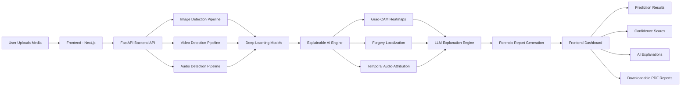

[](https://nextjs.org/)
[](https://react.dev/)
[](https://www.typescriptlang.org/)
[](https://tailwindcss.com/)
[](https://firebase.google.com/)
[](https://axios-http.com/)

# Vérité AI Frontend

Frontend application for **Vérité AI**, a modern deepfake detection platform supporting image, video, and audio analysis with Explainable AI visualizations and AI-generated forensic explanations.

## Related Repositories

- Backend: [Vérité AI Backend](https://github.com/your-username/verite-ai-backend)
- Hugging Face Collection: [Explainable Deepfake Detection](https://huggingface.co/collections/Redgerd/explainable-deepfake-detection)

## Features

- Image, video, and audio upload interface
- Real-time detection status updates
- Interactive Grad-CAM visualizations
- AI-generated forensic explanations
- Detection history dashboard
- Authentication and protected routes
- PDF forensic report downloads
- Responsive modern UI

## Core Pages

### Authentication
- Login and signup
- Firebase authentication
- Protected routes

### Detection Dashboard
- Upload media files
- Track inference progress
- View prediction confidence

### Explainability Viewer
- Grad-CAM overlays
- Forgery localization masks
- Attention visualizations

### Reports
- Download forensic analysis reports
- View historical detections

## System Workflow



## Running Locally

### Clone Repository

```bash
git clone https://github.com/hba777/X-DetectRT-Frontend.git
cd X-DetectRT-Frontend
```

### Install Dependencies

```bash
npm install
```

### Start Development Server

```bash
npm run dev
```

## Research & Thesis

This project was developed as a Final Year Project at National University of Sciences and Technology under the title:

**“Vérité AI: A Deepfake Detection Website with Explainable AI”**

The project was awarded a **Gold Star** in recognition of its technical innovation, research contribution, and practical implementation in the field of AI-driven media forensics.
